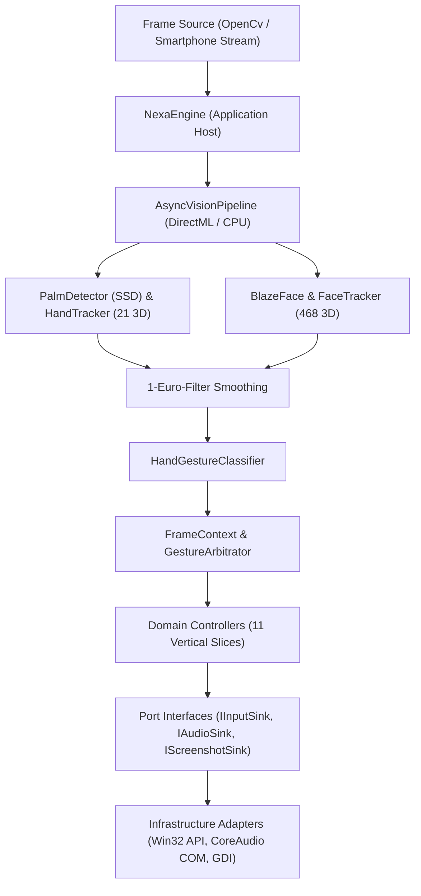

# N.E.X.A. — Neural EXtended Augmented-Reality Platform

> **Real-Time Touchless Spatial Control System for Windows 10/11**  
> Translates hand landmarks and facial biometrics into native operating system interactions via local ONNX neural networks and standard webcam streams.

<!-- 
  =======================================================================
  DEMO PLACEHOLDER: Insert your high-resolution animated demo GIF/MP4 here
  Example: 
  =======================================================================
-->
```
                                 +------------------------+
                                 |  Webcam / Smartphone   |
                                 +-----------+------------+
                                             |
                                    (60 FPS Mat Stream)
                                             v
                      +----------------------------------------------+
                      |   NEXA Asynchronous Vision Pipeline (ONNX)   |
                      |   - Palm Detection (SSD Anchor Regressor)    |
                      |   - Hand Pose Estimation (21 3D Landmarks)   |
                      |   - BlazeFace & FaceMesh (468 Biometric Pts) |
                      +----------------------+-----------------------+
                                             |
                                     (1€-Filtered Telemetry)
                                             v
                      +----------------------------------------------+
                      |  Domain Hexagonal Core & Gesture Arbitrator  |
                      |  - Mutual Exclusion Lock & Priority Manager  |
                      |  - Finite State Machines & Trend Regression  |
                      +----------------------+-----------------------+
                                             |
                                 (Dispatched OS Commands)
                                             v
                      +----------------------------------------------+
                      |  Native Windows Interop & CoreAudio Sinks    |
                      |  - SetWindowPos / Win32 Mouse & Keyboard     |
                      |  - MMDeviceEnumerator & IAudioEndpointVolume |
                      +----------------------------------------------+
```

---

## 1. Overview & Capabilities

N.E.X.A. is an edge-native, zero-cloud desktop interaction platform engineered in **C# 13 and .NET 10**. It transforms standard 2D webcam video into a sub-15ms, low-jitter AR spatial controller. By decoupling pure domain gesture kinematics from native Windows interop via **Hexagonal Architecture (Ports & Adapters)**, NEXA enables fluid window management, hands-free mouse navigation, continuous rotary audio tuning, and system security controls with zero runtime allocations on the inference hot path.

### Key Highlights
- **100% Offline & Local Execution:** Zero telemetry, zero cloud dependencies. Powered by Microsoft DirectML and ONNX Runtime with CPU fallback.
- **Global Gesture Arbitration:** Central mutual exclusion lock prevents competing gestures (e.g. window drag vs. volume tilt vs. sound mute) from cross-triggering.
- **Micro-Jitter Suppression:** Adaptive **$1\text{€}$-Filters** eliminate hand tremor without latency overhead during fast sweeps.
- **Dual Camera Input:** Seamlessly switch between local USB webcams and wireless LAN smartphone streaming (integrated HTTP/MJPEG receiver on port `8080`).

---

## 2. Complete Gesture Feature Matrix

The following table summarizes all 11 domain controllers currently active in NEXA:

| Category | Gesture & Pose | Trigger Mechanics & Conditions | Dispatched OS Action | Feedback Widget |
| :--- | :--- | :--- | :--- | :--- |
| **Mouse Navigation** | **Index Finger Pointing** (`Pointing`) | Pointing finger moving in frame. System top-priority lock. | Continuous physical cursor movement with $2.5\text{px}$ deadzone. | Crosshair reticle with speed-adaptive smoothing. |
| **Dwell-Click** | **Stationary Pointer Hover** | Hold pointer steady inside $28\text{px}$ radius for $0.85\text{s}$. | Left Mouse Click (`mouse_event(LEFTDOWN / LEFTUP)`). | Radial circular charging gauge with ripple flash. |
| **Window Drag** | **Clenched Fist** (`Fist`) | Clench fist on focused window for $>0.20\text{s}$. | Delta-based `SetWindowPos` moving active window. | Glowing cyan corner grab brackets. |
| **Window Auto-Snap** | **Fist Drag to Screen Edge** | Drag window into any of the 8 docking screen zones. | Snaps window to Left/Right half, Top maximize, or Corners. | Holographic bounding zone preview outline. |
| **Dual-Hand Resize** | **Bimanual Caliper** | Clench fist on primary hand + pinch/move second hand. | Dynamic aspect-ratio window scaling. | Orange corner resize calipers with live dimensions. |
| **Inertial Scrolling** | **Open Palm Swipe** (`Hand Up` / `Hand Down`) | Linear regression vertical velocity $>0.16\text{px/ms}$. | Dispatches standard `WHEEL_DELTA` (120) notch scroll events. | Floating animated directional swipe arrows. |
| **Master Volume** | **Single-Hand "L" Dial** (`L` Sign) | Single hand only (2 hands strictly blocked). Rotate index vector. | Continuous master speaker volume scalar adjustment ($0.0\text{--}1.0$). | Circular HUD rotary gauge with live $+/-\text{deg}$ delta. |
| **Screenshot** | **Dual "L" Viewfinder** (`L` + `L` Hands) | Form viewfinder box in front of body/face; hold touch for $2.0\text{s}$. | High-res fullscreen capture saved to disk & copied to clipboard. | AR camera framing box with $2.0\text{s}$ countdown arc. |
| **Media Control** | **Two-Hand Clap / Prayer** | Rapid dual-palm collision within $70\text{px}$ proximity. | Multimedia Play/Pause toggle (`VK_MEDIA_PLAY_PAUSE`). | Concentric white shockwave animation. |
| **Window Maximize** | **Two-Hand Upward Sweep** | Synchronous upward vertical swipe with 2 hands. | Maximizes active window (`ShowWindowAsync(SW_MAXIMIZE)`). | Expanding upward chevron animation. |
| **Window Minimize** | **Two-Hand Downward Sweep**| Synchronous downward vertical swipe with 2 hands. | Minimizes active window (`ShowWindowAsync(SW_MINIMIZE)`). | Collapsing downward chevron animation. |
| **Monitor Throw** | **Blade / Karate-Chop Swipe** | Edge-on vertical hand swipe across screen midline. | Transfers active window to adjacent left/right monitor. | Directional warp transfer arrows. |
| **Workstation Lock** | **4-Step Sequence** | Sequence: `Open` $\rightarrow$ `Fist` $\rightarrow$ `Open` $\rightarrow$ `Fist` within $2.5\text{s}$ per step. | Locks Windows workstation (`LockWorkStation`). | Step progress indicators ($1/4 \rightarrow 4/4$) with countdown bar. |
| **Undo / Redo** | **Peace Sign Wrist Twist** (`Peace`) | Twist wrist clockwise ($>28^\circ$) for Redo, counter-clockwise for Undo. | Dispatches `Ctrl + Z` (Undo) or `Ctrl + Y` (Redo). | Holographic dial reticle with rotation vector. |
| **Mic Mute ("Shhh")** | **4 Fingers to Mouth** | Hold 4 fingers vertically in front of mouth for $2.0\text{s}$ ($5.0\text{s}$ cooldown). | Toggles default Windows recording microphone mute. | Red/Green mute banner with circular charging ring. |
| **Speaker Mute** | **Two Hands to Ears** | Hold both hands at sides of head/ears for $2.0\text{s}$ ($5.0\text{s}$ cooldown). | Toggles master speaker sound mute (face-independent fallback). | Dual ear charging rings with sound mute overlay. |

---

## 3. Architecture & Design Patterns

NEXA is structured as a **Multi-Project Hexagonal Solution (.NET 10)** strictly isolating computational math from hardware adapters:



### Architectural Principles
1. **Hexagonal Domain Separation (`NEXA.Domain`):** Contains pure mathematical filters ($1\text{€}$-Filter, Linear Regression), kinematic detectors, gesture state machines, and Port interfaces (`IInputSink`, `IAudioSink`). Zero references to UI or platform binaries.
2. **Vertical Slice Pattern:** Each feature (e.g. `Volume`, `Scroll`, `WindowGrab`, `HearNoEvil`) is organized into dedicated `Detector` (math), `State` (POCO state machine), `Controller` (lifecycle), and `Renderer` (AR visual feedback) components.
3. **Global Gesture Arbitrator (`IGestureArbitrator`):** Manages exclusive execution locks. Prevents accidental volume adjustments during window drags, blocks sound changes when 2 hands are framing screenshots, and grants immediate high-priority override to mouse pointing.
4. **Zero-Allocation Ring Buffers (`MatRingBuffer`):** Recycles native OpenCV matrix pointers in a fixed 4-slot ring buffer to eliminate Gen-0 GC allocation pressure during 60 FPS processing loops.

---

## 4. Technology Stack & Technical Justifications

| Component | Selected Technology | Technical Justification |
| :--- | :--- | :--- |
| **Runtime & Language** | **C# 13 / .NET 10** | Modern memory primitives (`Span<T>`, `Memory<T>`, `ref struct`), zero-cost abstraction generics, and high-performance JIT optimizations. |
| **Computer Vision** | **OpenCvSharp4** | Lightweight cross-platform native OpenCV bindings with direct `Mat.Data` pointer access for sub-millisecond frame transformations. |
| **Deep Learning Inference**| **Microsoft.ML.OnnxRuntime.DirectML** | Native hardware acceleration across all DirectX 12 GPUs (NVIDIA, AMD, Intel) with automatic fallback to CPU without CUDA driver bloat. |
| **Vision Models** | **MediaPipe Palm + HandPose + BlazeFace** | Optimized single-stage SSD anchor detection and lightweight 3D coordinate regression designed for low-power edge execution. |
| **Signal Processing** | **Custom 1€-Filter (1EuroFilter)** | First-order low-pass filter with speed-adaptive cutoff frequency. Eliminates jitter during slow movements while avoiding phase lag during fast motions. |
| **OS Automation** | **Native Win32 Interop (`P/Invoke`)** | Direct execution of `SetWindowPos`, `SendInput`, `GetCursorPos`, and `LockWorkStation` with microsecond dispatch latency. |
| **Audio Subsystem** | **Windows Core Audio COM Interop** | Pure COM interfaces (`MMDeviceEnumerator`, `IAudioEndpointVolume`) providing stepless volume and mute control without third-party audio drivers. |
| **Dependency Injection** | **Microsoft.Extensions.DependencyInjection** | Clean Inversion-of-Control container wiring Domain Ports to Infrastructure Adapters with lifecycle decoupling. |
| **Unit Testing** | **xUnit + Fake Adapters (FakeInputSink, etc.)** | Fast, deterministic testing suite (123+ unit tests) decoupled from physical cameras, audio cards, and desktop windows. |
| **Benchmarking** | **BenchmarkDotNet** | Automated micro-benchmarking of mathematical filters, coordinate transforms, and regression math. |

---

## 5. Setup & Installation

### Prerequisites
- **Operating System:** Windows 10 (Build 19041+) or Windows 11 (64-bit).
- **Runtime:** [.NET 10 SDK](https://dotnet.microsoft.com/download/dotnet/10.0) or higher.
- **Hardware:** Standard USB Webcam or modern smartphone on the same local Wi-Fi network. GPU with DirectX 12 support recommended for DirectML acceleration.

### Quick Start
1. **Clone Repository:**
   ```bash
   git clone https://github.com/meelinaa/NEXA.git
   cd NEXA
   ```

2. **Verify Model Assets:**
   Ensure the pre-trained ONNX models are present in the `NEXA/models/` folder:
   - `palm_detection.onnx`
   - `handpose_estimation.onnx`
   - `blazeface.onnx`
   - `face_mesh.onnx`

3. **Run Application:**
   ```bash
   # Launch with default USB webcam (Index 0)
   dotnet run --project NEXA

   # Launch directly in Wireless Smartphone Camera mode
   dotnet run --project NEXA -- --phone

   # Launch with a specific camera index or network stream
   dotnet run --project NEXA -- --cam 1
   dotnet run --project NEXA -- --url "http://192.168.1.50:8080/video"
   ```

4. **Run Automated Test Suite:**
   ```bash
   dotnet test
   ```

---

## 6. Interactive Keyboard Controls

While the camera feed window is focused, use the following hotkeys to toggle features and visual layers:

| Key | Action / Feature Toggle |
| :---: | :--- |
| `ESC` / `Q` | Exit application cleanly |
| `C` | Toggle Mouse Navigation & Dwell-Click |
| `W` | Toggle Swipe Scrolling |
| `G` | Toggle Window Grabbing & Dual-Hand Resizing |
| `T` | Toggle Two-Hand Gestures (Maximize / Minimize / Screenshot / Play-Pause) |
| `M` | Toggle Multi-Monitor Throw (Blade Swipe) |
| `V` | Toggle Volume Control (L-Gesture Rotary Dial) |
| `L` | Toggle Workstation Lock Gesture (Open-Fist-Open-Fist) |
| `U` | Toggle Undo / Redo Gesture (Peace Sign Wrist-Twist) |
| `X` | Toggle "Shhh" Microphone Mute (4 Fingers to Mouth) |
| `E` | Toggle "Hear No Evil" Speaker Sound Mute (Hands to Ears) |
| `F` | Toggle Face Mesh, Eye/Mouth Reticles & Head Bounding Box |
| `S` | Toggle 1€-Filter Landmark Smoothing |
| `J` | Toggle Hand Skeleton Joint Nodes |
| `B` | Toggle Hand Bounding Boxes & HUD Labels |
| `R` | Reset Virtual AR Test Window (Position & Scale) |
| `H` | Toggle Real-Time Telemetry HUD Overlay |

---

## 7. Technical Highlights

- **Speed-Adaptive 1€-Filter:** Standard low-pass filters introduce sluggish phase lag during rapid hand sweeps. The $1\text{€}$-Filter dynamically shifts its cutoff frequency based on instantaneous derivative velocity $\dot{x}$, ensuring dead-still stability when hovering over buttons and zero-lag tracking when sweeping across monitors.
- **Delta-Based Relative Window Translation:** Rather than attempting absolute desktop coordinate mapping (which causes windows to snap jarringly), window positioning is calculated purely via relative frame deltas $(\Delta x, \Delta y)$ anchored at the fist-grab initiation moment.
- **Finite State Machine Gating with Dynamic Timeouts:** Complex multi-step gestures (such as the 4-step workstation lock) utilize strict discrete state machines with sliding time windows ($2.5\text{s}$ timeout per transition) and refractory cooldown periods to prevent false-positive activations.
- **DirectML In-Memory Session Warm-Up:** Pre-warms ONNX inference sessions asynchronously at application boot with dummy tensors, compiling GPU shader pipelines before the capture loop begins to eliminate first-frame hitches.

---

## 8. Known Limitations & Roadmap

- **Windows-Specific Platform Layer:** OS window manipulation and audio sinks are coupled to Win32 User32 APIs and CoreAudio COM interfaces. Linux/macOS support would require implementing separate platform adapters.
- **Occlusion Under High Proximity:** When one hand fully overlaps the other at extreme depth angles, MediaPipe 2D landmark estimators may experience momentary tracking degradation.
- **Multi-Monitor Coordinate Scaling:** Systems with mismatched per-monitor DPI scaling (e.g. 100% on Display 1 and 175% on Display 2) require OS-level DPI awareness configuration for pixel-perfect window placement.

---

## 9. Development Approach

NEXA was conceptualized and developed with AI-assisted pair-programming workflows, where architectural decision-making, system modeling, signal processing design, and quality assurance were directed through iterative engineering refinement.

---

## 10. License

This project is licensed under the [MIT License](LICENSE).
